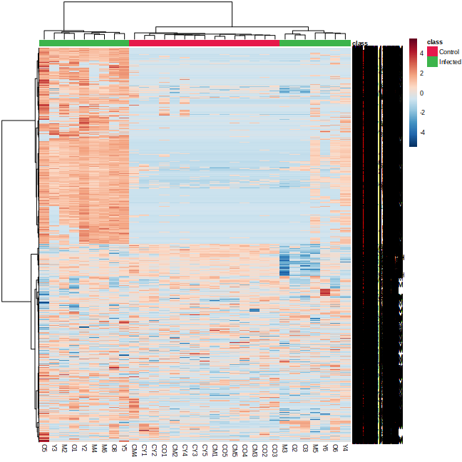

# MetaboAnalyst Statistical Analysis - One Factor Design

This repository contains a comprehensive metabolomics analysis using MetaboAnalystR for a one-factor experimental design comparing infected vs. control samples.

## 📊 Analysis Overview

This analysis performs statistical comparisons between two groups (Infected vs. Control) using various statistical methods including:
- **Fold Change Analysis**
- **T-tests (parametric)**
- **Volcano Plot Analysis**
- **ANOVA**
- **Principal Component Analysis (PCA)**
- **Correlation Analysis**
- **Machine Learning Approaches (PLS-DA, OPLS-DA, Random Forest, SVM)**

## 🔬 Complete R Script

The main analysis script is: `statistical_one_factor_metabolite.R`

This script performs:
1. **Data Preprocessing**: Normalization using Log transformation and Mean centering
2. **Statistical Analysis**: Fold change, t-tests, volcano plots, ANOVA
3. **Multivariate Analysis**: PCA, PLS-DA, OPLS-DA
4. **Machine Learning**: Random Forest, SVM classification

## 📈 Key Results

### Normalization Summary


### Fold Change Analysis


### T-test Results


### Volcano Plot


### ANOVA Results


### PCA Analysis



### Correlation Analysis


### PLS-DA Analysis


### OPLS-DA Analysis


### Random Forest Analysis


### SVM Analysis


## 📁 File Structure

```
MetaboAnalyst_Statistical_Analysis_one_factor/
├── README.md
├── statistical_one_factor_metabolite.R
└── results/
    ├── *.png (All output plots)
    ├── *.csv (Statistical results)
    └── *.json (Interactive plots)
```

## 🚀 Usage

1. **Install Required Packages**: The script automatically installs all required R packages
2. **Prepare Data**: Ensure your data is in the correct format (CSV with samples as rows and metabolites as columns)
3. **Run Analysis**: Execute the R script
4. **Interpret Results**: Review the generated plots and statistical tables

## 📋 Requirements

- R (version 3.6 or higher)
- RStudio (recommended)
- Internet connection for package installation

## 📊 Output Files

The analysis generates multiple output files including:
- **Statistical tables** (.csv files)
- **Visualization plots** (.png files)
- **Interactive plots** (.json files)

All results are saved in the `results/` directory.

## 🔍 Key Findings

This analysis provides comprehensive insights into:
- Metabolite differences between infected and control groups
- Statistical significance of observed changes
- Multivariate patterns and group separation
- Machine learning-based classification performance

## 📞 Contact

For questions or issues related to this analysis, please refer to the MetaboAnalystR documentation or create an issue in this repository.

---

**Note**: This analysis was performed using MetaboAnalystR version from GitHub (xia-lab/MetaboAnalystR).
