# MetaboAnalyst Statistical Analysis - One Factor Design

This repository contains a comprehensive metabolomics analysis using MetaboAnalystR for a one-factor experimental design comparing infected vs. control samples.

## 📊 Analysis Overview

This analysis performs statistical comparisons between two groups (Infected vs. Control) using various statistical methods including:
- **Fold Change Analysis**
- **T-tests (parametric)**
- **Volcano Plot Analysis**
- **ANOVA**
- **Principal Component Analysis (PCA)**
- **Correlation Analysis**
- **Machine Learning Approaches (PLS-DA, OPLS-DA, Random Forest, SVM)**

---

## 🔬 Step-by-Step Analysis: Code, Description, Plot

### 1. Package Installation and Setup

**R Code:**
```r
metanr_packages <- function(){
  metr_pkgs <- c("impute", "pcaMethods", "globaltest", "GlobalAncova", "Rgraphviz", "preprocessCore", "genefilter", "sva", "limma", "KEGGgraph", "siggenes","BiocParallel", "MSnbase", "multtest","RBGL","edgeR","fgsea","devtools","crmn","httr","qs")
  list_installed <- installed.packages()
  new_pkgs <- subset(metr_pkgs, !(metr_pkgs %in% list_installed[, "Package"]))
  if(length(new_pkgs)!=0){
    if (!requireNamespace("BiocManager", quietly = TRUE))
      install.packages("BiocManager")
    BiocManager::install(new_pkgs)
    print(c(new_pkgs, " packages added..."))
  }
  if((length(new_pkgs)<1)){
    print("No new packages added...")
  }
}
metanr_packages()
library(devtools)
devtools::install_github("xia-lab/MetaboAnalystR", build = TRUE, build_vignettes = TRUE, build_manual =T)
library(MetaboAnalystR)
```

**Description:** This code installs and loads all required packages for MetaboAnalystR analysis, including Bioconductor packages and the main MetaboAnalystR library.

---

### 2. Data Loading and Initialization

**R Code:**
```r
rm(list = ls())
mSet<-InitDataObjects("conc", "stat", FALSE);
mSet<-Read.TextData(mSet, "final_positive_negative_comb.csv", "rowu", "disc");
df = read.csv("final_positive_negative_comb.csv")
mSet<-SanityCheckData(mSet);
print(unique(mSet$dataSet$cls))
print(table(mSet$dataSet$cls))
```

**Description:** This code initializes the MetaboAnalystR object, reads the metabolomics data from CSV file, performs sanity checks, and displays the sample groups and their counts.

---

### 3. Data Normalization

**R Code:**
```r
mSet<-ReplaceMin(mSet);
mSet<-PreparePrenormData(mSet);
mSet<-Normalization(mSet, "NULL", "LogNorm", "MeanCenter", "S10T0", ratio=FALSE, ratioNum=20);
mSet<-PlotNormSummary(mSet, "norm_0_", format ="png", dpi=72, width=NA);
mSet<-PlotSampleNormSummary(mSet, "snorm_0_", format = "png", dpi=72, width=NA);
```

**Description:** This code performs data preprocessing including missing value replacement, log transformation, and mean centering. It then generates plots showing the normalization summary and sample normalization results.

**Results:**
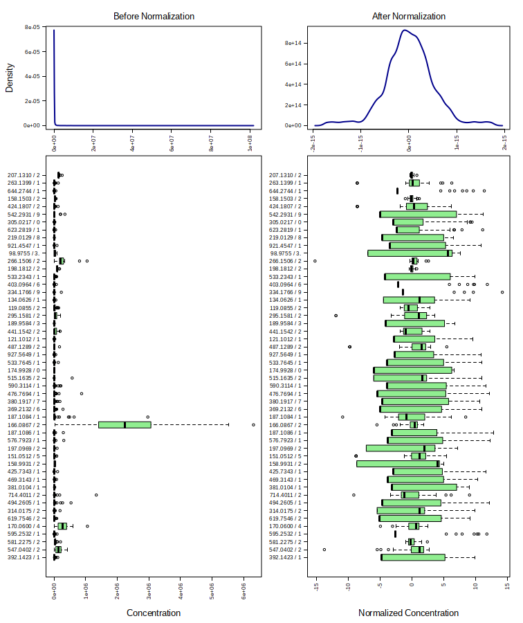
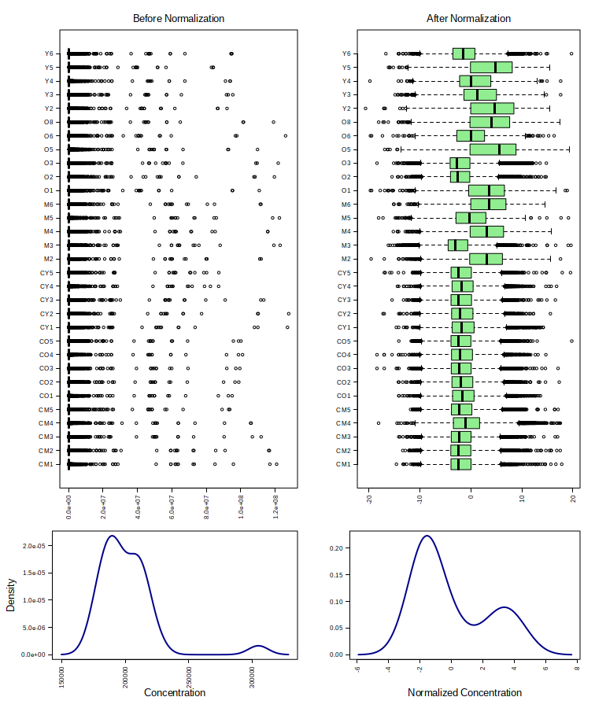

---

### 4. Group Assignment and Fold Change Analysis

**R Code:**
```r
levels(mSet$dataSet$cls)
levels(mSet$dataSet$cls) <- c("Infected", "Control")
mSet <- FC.Anal.unpaired(mSet, 2.0)   # 2.0 is the fold-change threshold
mSet<-PlotFC(mSet, "fc_0_", "png", 72, width=NA)
mSet$analSet$fc$fc.log
```

**Description:** This code assigns group labels (Infected vs Control), performs fold change analysis with a threshold of 2.0, and generates a fold change plot showing metabolites with significant changes between groups.

**Results:**
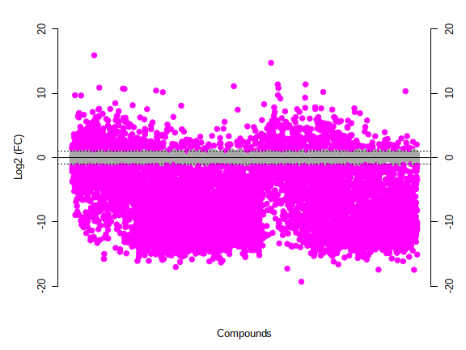

---

### 5. T-test Analysis

**R Code:**
```r
mSet <- Ttests.Anal(mSet, nonpar = FALSE, threshp = 0.05, paired = FALSE, equal.var = TRUE)
mSet$analSet$tt$adj.p.value <- p.adjust(mSet$analSet$tt$p.value, method = "fdr")
mSet<-PlotTT(mSet, imgName = "tt_0_", format = "png", dpi = 72, width=NA)
```

**Description:** This code performs parametric t-tests between groups with a p-value threshold of 0.05, applies FDR correction (Benjamini-Hochberg), and generates a plot showing statistically significant metabolites.

**Results:**
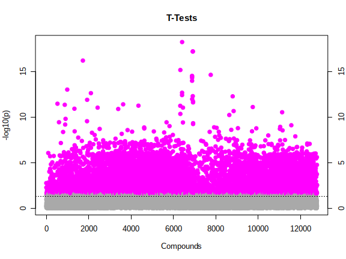

---

### 6. Volcano Plot Analysis

**R Code:**
```r
mSet<-Volcano.Anal(mSet, FALSE, 2.0, 0, F, 0.1, TRUE, "raw")
mSet<-PlotVolcano(mSet, "volcano_0_",1, format ="png", dpi=72, width=NA)
```

**Description:** This code creates a volcano plot that combines fold change and statistical significance, showing metabolites that are both significantly different and have high fold changes between groups.

**Results:**
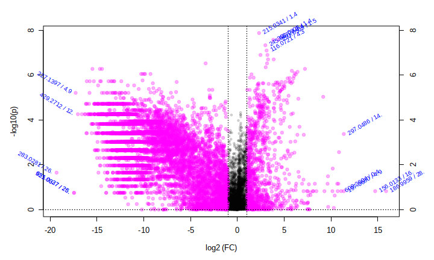

---

### 7. ANOVA Analysis

**R Code:**
```r
mSet <- ANOVA.Anal(mSet, F, 0.05, "fisher")
mSet <- PlotANOVA(mSet, "aov_0_", "png", 72, width=NA)
```

**Description:** This code performs one-way ANOVA analysis to identify metabolites with significant differences across groups, using Fisher's method and a p-value threshold of 0.05.

**Results:**
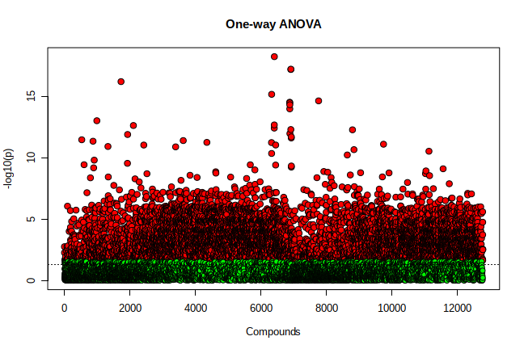

---

### 8. Correlation Analysis

**R Code:**
```r
mSet<-PlotCorrHeatMap(mSet, "corr_0_", "png", 72, width=NA, "col", "pearson", "bwm", "overview", F, F, 0.0)
mSet<-PlotCorrHeatMap(mSet, "corr_1_", format = "png", dpi=72, width=NA, "col", "spearman", "bwm", "detail", F, F, 100, 100)
```

**Description:** This code generates correlation heatmaps using both Pearson and Spearman correlations, showing relationships between metabolites in the dataset.

**Results:**
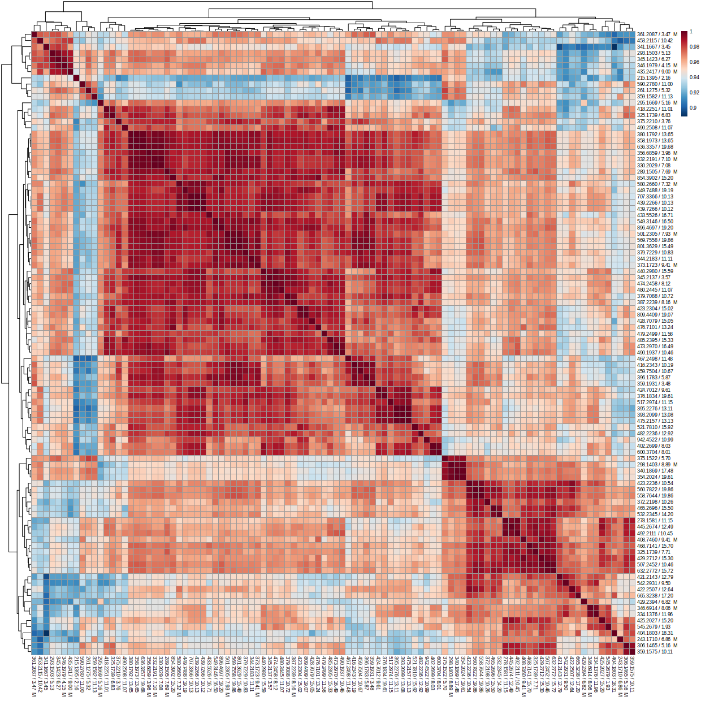

---

### 9. Principal Component Analysis (PCA)

**R Code:**
```r
mSet<-PCA.Anal(mSet)
mSet<-PlotPCAPairSummary(mSet, "pca_pair_0_", format = "png", dpi = 72, width=NA, 5)
mSet<-PlotPCAScree(mSet, "pca_scree_0_", "png", dpi = 72, width=NA, 5)
mSet<-PlotPCAScore2D(mSet, "pca_score2d_0_", format = "png", dpi = 72, width=NA, 1,2,0.95,0,0)
mSet<-PlotPCABiplot(mSet, "pca_biplot_0_", format = "png", dpi = 72, width=NA, 1,2)
```

**Description:** This code performs PCA analysis to reduce dimensionality and visualize group separation. It generates multiple plots including scree plot (variance explained), score plot (sample separation), and biplot (variable contributions).

**Results:**
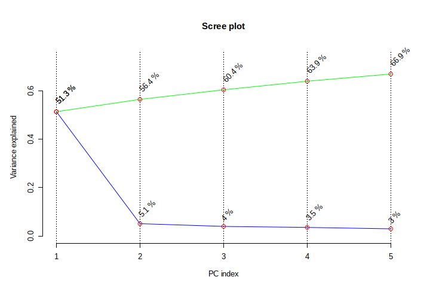
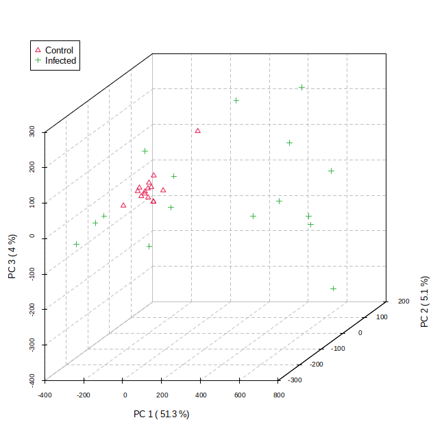
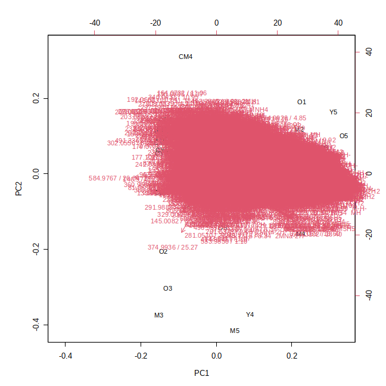

---

### 10. PLS-DA Analysis

**R Code:**
```r
mSet<-PLSR.Anal(mSet, reg=TRUE)
mSet<-PlotPLSPairSummary(mSet, "pls_pair_0_", format = "png", dpi = 72, width=NA, 5)
mSet<-PlotPLS2DScore(mSet, "pls_score2d_0_", format = "png", dpi = 72, width=NA, 1,2,0.95,0,0)
mSet<-PlotPLSLoading(mSet, "pls_loading_0_", format = "png", dpi = 72, width=NA, 1, 2);
mSet<-PLSDA.CV(mSet, "T",5, "Q2")
mSet<-PlotPLS.Classification(mSet, "pls_cv_0_", format = "png", dpi = 72, width=NA)
mSet<-PLSDA.Permut(mSet, 100, "accu")
mSet<-PlotPLS.Permutation(mSet, "pls_perm_1_", format = "png", dpi = 72, width=NA)
```

**Description:** This code performs Partial Least Squares Discriminant Analysis (PLS-DA) for supervised classification. It includes cross-validation, permutation testing, and generates score plots and loading plots to show group separation and variable importance.

**Results:**
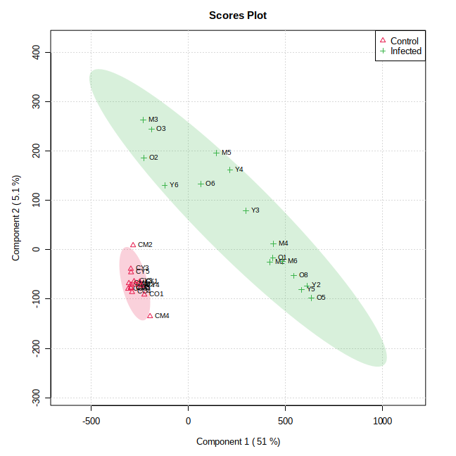
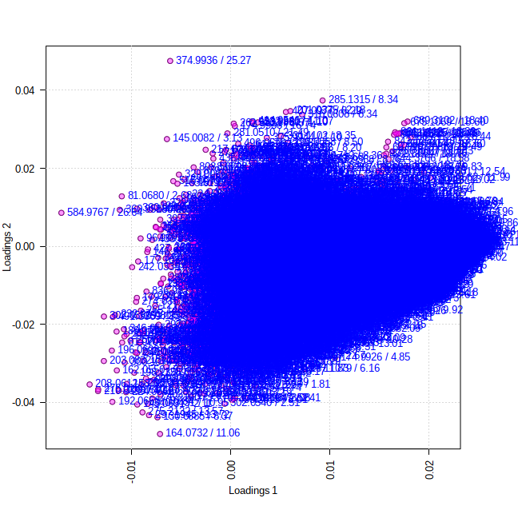

---

### 11. OPLS-DA Analysis

**R Code:**
```r
mSet<-OPLSR.Anal(mSet, reg=TRUE)
mSet<-PlotOPLS2DScore(mSet, "opls_score2d_0_", format = "png", dpi = 72, width=NA, 1,2,0.95,0,0)
mSet<-PlotOPLS.Splot(mSet, "opls_splot_0_", format = "png", dpi = 72, width=NA, "Splot_0_", 1,2);
```

**Description:** This code performs Orthogonal Partial Least Squares Discriminant Analysis (OPLS-DA), which separates predictive variation from orthogonal variation. It generates score plots and S-plots to show group separation and identify important variables.

**Results:**
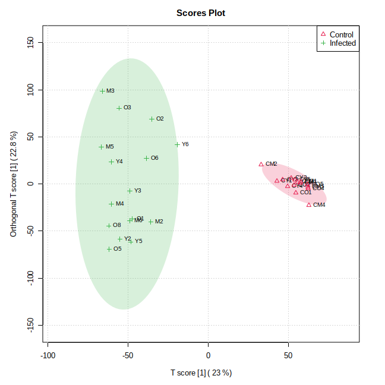
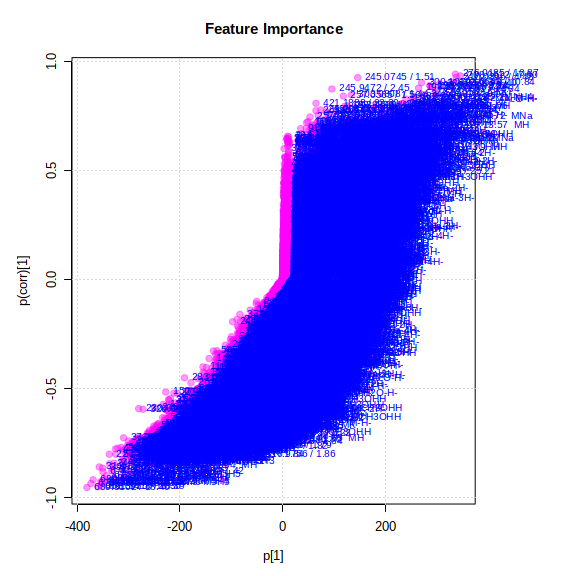

---

### 12. Random Forest Analysis

**R Code:**
```r
mSet<-RF.Anal(mSet, 500, 7, 1)
mSet<-PlotRF.Classify(mSet, "rf_cls_0_", format = "png", dpi = 72, width=NA)
mSet<-PlotRF.Classify(mSet, "rf_imp_0_", format = "png", dpi = 72, width=NA)
```

**Description:** This code performs Random Forest analysis with 500 trees and 7 variables per split. It generates classification plots showing prediction accuracy and variable importance plots showing which metabolites are most important for group classification.

**Results:**
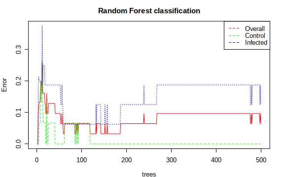
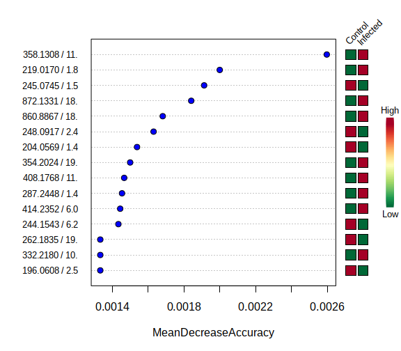

---

### 13. SVM Analysis

**R Code:**
```r
mSet<-SVM.Anal(mSet)
mSet<-PlotSVM.Classification(mSet, "svm_cls_0_", format = "png", dpi = 72, width=NA)
mSet<-PlotSVM.Classification(mSet, "svm_imp_0_", format = "png", dpi = 72, width=NA)
```

**Description:** This code performs Support Vector Machine (SVM) analysis for classification. It generates plots showing classification performance and variable importance, helping identify key metabolites for distinguishing between groups.

**Results:**
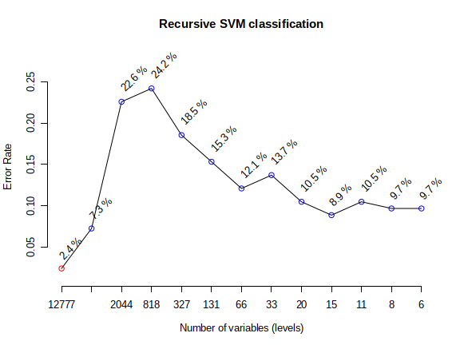
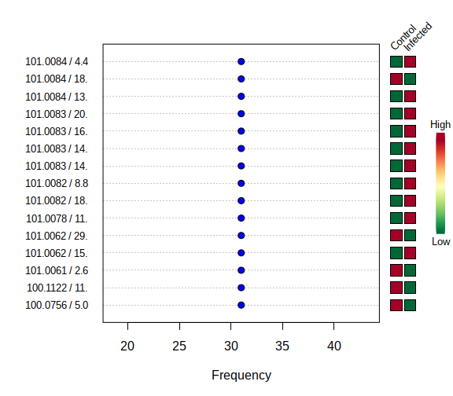

---

## 📁 File Structure

```
MetaboAnalyst_Statistical_Analysis_one_factor/
├── README.md
├── statistical_one_factor_metabolite.R
└── results/
    ├── *.png (All output plots)
    └── *.json (Interactive plots)
```

## 🚀 Usage

1. **Install Required Packages**: The script automatically installs all required R packages
2. **Prepare Data**: Ensure your data is in the correct format (CSV with samples as rows and metabolites as columns)
3. **Run Analysis**: Execute the R script
4. **Interpret Results**: Review the generated plots and statistical tables

## 📋 Requirements

- R (version 3.6 or higher)
- RStudio (recommended)
- Internet connection for package installation

## 📊 Output Files

The analysis generates multiple output files including:
- **Visualization plots** (.png files)
- **Interactive plots** (.json files)

All results are saved in the `results/` directory.

## 🔍 Key Findings

This analysis provides comprehensive insights into:
- Metabolite differences between infected and control groups
- Statistical significance of observed changes
- Multivariate patterns and group separation
- Machine learning-based classification performance


---

**Note**: This analysis was performed using MetaboAnalystR version from GitHub (xia-lab/MetaboAnalystR).
